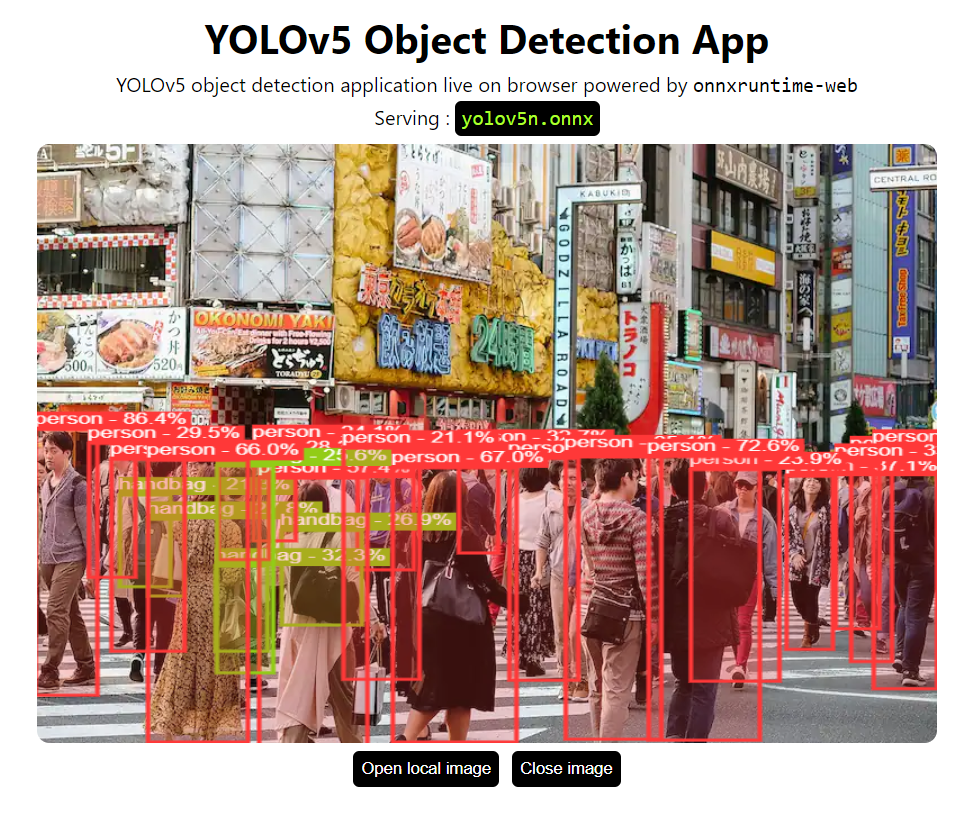

# YOLOv5 on Browser with onnxruntime-web

<p align="center">
  
</p>


---

Object Detection application right in your browser.
Serving YOLOv5 in browser using onnxruntime-web with `wasm` backend.

## Setup

```bash
git clone https://github.com/Hyuto/yolov5-onnxruntime-web.git
cd yolov5-onnxruntime-web
yarn install # Install dependencies
```

## Scripts

```bash
yarn start # Start dev server
yarn build # Build for productions
```

## Model

YOLOv5n model converted to onnx model and adding `NonMaxSuppression` operator.

```
used model : yolov5n-nms
size       : 7.5 Mb
```

## Use another model

> :warning: **Size Overload** : used YOLOv5 model in this repo is the smallest with size of 7.5 MB, so other models is definitely bigger than this which can cause memory problems on browser.

### Original Model (Without NMS)

Use another YOLOv5 model.

1. Clone [yolov5](https://github.com/ultralytics/yolov5) repository

   ```bash
   git clone https://github.com/ultralytics/yolov5.git && cd yolov5
   ```

   Install `requirements.txt` first

   ```bash
   pip install -r requirements.txt
   ```

2. Export model to onnx format
   ```bash
   export.py --weights yolov5*.pt --include onnx
   ```
3. Copy `yolov5*.onnx` to `./public/model`
4. Update `modelName` in `App.jsx` to new model name
   ```jsx
   ...
   // configs
   const modelName = "yolov5*.onnx"; // change to new model name
   const withNMS = false; // set this to false because we need to perform NMS algorithm outside model
   const modelInputShape = [1, 3, 640, 640];
   ...
   ```
5. Done! 😊

### Modified Model (With NMS)

Modifying original YOLOv5 onnx model to perform Non Max Suppression algorithm inside the model.

1. Export selected original YOLOv5 model to onnx, check how to [deploy original model](#original-model-without-nms) from step 1 to step 2.
2. Download this script [add-nms.py](https://gist.github.com/Hyuto/28498fdee3ab56394e49d6b366229980) and install the dependencies
3. Run `add-nms.py` and set `--model` argument to path of your selected YOLOv5 onnx model.

   Example:

   ```
   python add-nms.py --model ./yolov5*.onnx
   ```

   The script will generate new onnx model with name `yolov5*-nms.onnx`

4. Copy `yolov5*-nms.onnx` to `./public/model`
5. Update `modelName` in `App.jsx` to new model name
   ```jsx
   ...
   // configs
   const modelName = "yolov5*-nms.onnx"; // change to new model name
   const withNMS = true; // set this to true because we NMS algorithm is performed inside the model
   const modelInputShape = [1, 3, 640, 640];
   ...
   ```
6. Done! 😊

## Reference

- https://github.com/ultralytics/yolov5
- https://github.com/doleron/yolov5-opencv-cpp-python
